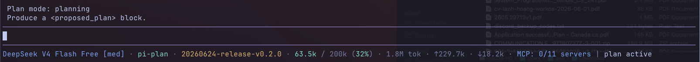
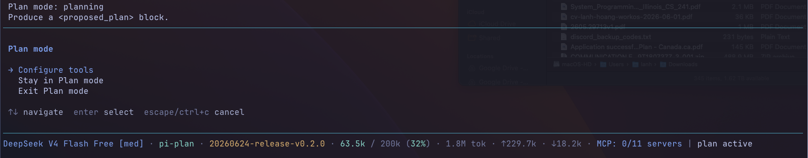
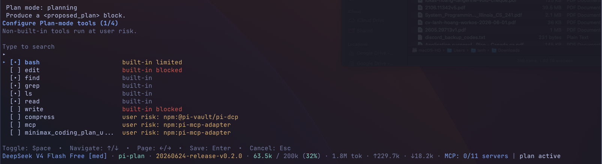

# @pi-vault/pi-plan

[](https://www.npmjs.com/package/@pi-vault/pi-plan)
[](https://github.com/pi-vault/pi-plan/actions/workflows/quality.yml)
[](https://nodejs.org/)
[](LICENSE)

## Description

`@pi-vault/pi-plan` adds a read-only plan mode to Pi so you can explore a codebase, clarify the request, and get a decision-complete implementation plan before any code changes happen.

## Screenshots





## Install

```bash
pi install npm:@pi-vault/pi-plan
```

Reload Pi after installing or upgrading:

```text
/reload
```

## Quick Start

Start plan mode:

```text
/plan
```

Start plan mode and send the planning prompt immediately:

```text
/plan prepare the next release notes and docs
```

Configure additional optional tools that are available during plan mode:

```text
/plan:tools
```

Exit plan mode and restore full tool access:

```text
/plan:exit
```

Start Pi directly in plan mode:

```bash
pi --plan
```

## What Plan Mode Does

When plan mode is active, the agent stays in exploration and planning mode until you explicitly exit or choose to implement the proposed plan.

Plan mode is designed for work that benefits from an explore-first workflow:

- inspect the repo before changing anything
- clarify requirements and tradeoffs
- produce a single decision-complete `<proposed_plan>` block
- hand the approved plan back into normal execution when you are ready

## Command Reference

### `/plan`

- If plan mode is off, `/plan` turns it on.
- If you pass text after `/plan`, that text is sent as the planning prompt.
- If plan mode is already on and you run `/plan` with no arguments, Pi opens the plan-mode menu.

### `/plan:tools`

Opens the plan-mode tool selector. If plan mode is not active yet, Pi enables plan mode first and then opens the selector.

Use this when you want to allow additional tools during planning. Built-in `edit` and `write` stay blocked, but extra tools may have broader capabilities, so enable them deliberately.

### `/plan:exit`

Turns off plan mode and restores the tool set that was active before planning started.

## Safety Rules During Plan Mode

Plan mode keeps the agent in a read-only workflow by changing which tools are available:

- built-in `edit` and `write` are blocked
- `bash` is limited to allowlisted read-only commands
- mutating shell commands are blocked with an explicit plan-mode error
- safe built-in planning tools remain available: `read`, `bash`, `grep`, `find`, and `ls`

Additional optional tools are off by default. You can selectively enable them with `/plan:tools`. Built-in `edit` and `write` remain blocked, but enabled extra tools may still be able to mutate state through their own interfaces.

## Proposed Plan Detection And Handoff

The extension adds a plan-mode system prompt that tells the agent to produce exactly one `<proposed_plan>` block.

When the agent returns a proposed plan, `@pi-vault/pi-plan` automatically:

- detects the plan block
- stores the latest proposed plan in session state
- updates the status and widget UI to show that a plan is ready
- opens a ready menu so you can implement the plan, stay in plan mode, or exit

If you choose **Implement this plan**, plan mode is disabled first, full tool access is restored, and the saved plan is sent back into the conversation as the next implementation instruction.

## Tool Selector

`/plan:tools` opens a custom TUI selector for additional optional tools.

Safe built-in planning tools always stay available, blocked built-ins stay blocked, and any extra tools you enable persist across turns and session restore. Non-built-in tools run at your discretion and may provide capabilities beyond the default read-only planning tool set.

## Development

```bash
pnpm install
pnpm check
pnpm run pack:dry-run
pnpm run release:check
```

## License

MIT
