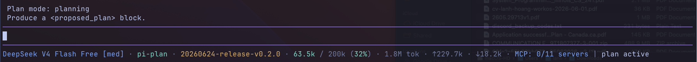
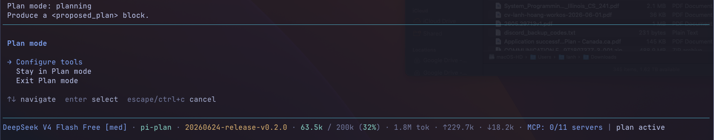
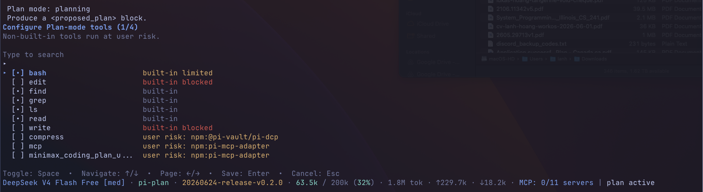

# @pi-vault/pi-plan

[](https://www.npmjs.com/package/@pi-vault/pi-plan)
[](https://github.com/pi-vault/pi-plan/actions/workflows/quality.yml)
[](https://nodejs.org/)
[](LICENSE)

## Description

`@pi-vault/pi-plan` adds a read-only planning workflow to Pi. Use it to inspect the repo, clarify intent, and return a decision-complete implementation plan before any write-capable work starts. Plan mode is read-only by default; built-in `edit` and `write` are independently disabled until you opt them in.

## Screenshots





## Install And Reload

Install or upgrade the extension:

```bash
pi install npm:@pi-vault/pi-plan
```

Reload Pi after installing or upgrading:

```text
/reload
```

## Use Plan Mode

### Start planning

Start Plan mode:

```text
/plan
```

Start Plan mode and send the planning prompt immediately:

```text
/plan prepare the next release notes and docs
```

Start Pi directly in Plan mode:

```bash
pi --plan
```

Toggle Plan mode with the keyboard:

```text
Ctrl+Alt+P
```

`Ctrl+Alt+P` works while the agent is idle and queues a pending toggle when Pi is busy. `Shift+Tab` remains Pi's reserved thinking-level shortcut.

### Work through a plan

1. Let the agent inspect the repo and ask clarifying questions.
2. When the plan is ready, you receive exactly one `<proposed_plan>` block.
3. While the agent is idle, choose what to do next:
   - **Implement this plan** - turn Plan mode off, restore full tool access, and submit `Implement the plan.` in the same conversation.
   - **Save plan** - keep Plan mode active and write the exact current plan to one new lowercase `.md` file in the workspace root. The agent chooses the filename; you do not provide a path.
   - **Stay in Plan mode** - keep planning.
   - **Exit Plan mode** - leave planning without removing prior user or assistant messages. The latest-plan menu cache remains available until the next turn starts.
   - **Show latest proposed plan** - review the current plan again.
   - **Configure tools** - change which optional tools are available during planning.

### Save plan behavior

**Save plan** is available only while the agent is idle.

When you choose it:

- Plan mode stays enabled.
- Pi asks the agent to choose a new lowercase `.md` filename in the workspace root, typically dated like `YYYY-MM-DD-<topic>.md`.
- For that save turn only, Pi temporarily allows built-in `write` for the exact captured plan.
- If the write fails, the agent can retry during the same save turn.
- After a successful save, `write` is disabled again and Plan mode remains active.
- Save-path validation rejects existing targets, broken symlinks, path traversal, and any path that resolves outside the current workspace.

## Command Reference

| Command          | Behavior                                                                                                  |
| ---------------- | --------------------------------------------------------------------------------------------------------- |
| `/plan`          | Turn on Plan mode, or open the Plan mode menu if it is already on.                                        |
| `/plan <prompt>` | Turn on Plan mode and send `<prompt>` as the planning request.                                            |
| `/plan:tools`    | Open the optional tool selector. If Plan mode is not active yet, Pi enables it first.                     |
| `/plan:exit`     | Turn off Plan mode and restore the previous tool set without removing conversation history.               |
| `pi --plan`      | Start Pi directly in Plan mode.                                                                           |

If Pi is busy, mode-changing commands and actions from the `/plan` menu wait until the current turn settles. Only the latest queued switch is applied. An automatically opened plan-ready menu cannot queue a mode change until Pi is fully settled; retry with `/plan` if warned. Showing a plan and staying in Plan mode remain immediate; tool configuration requires Pi to be idle.

## Configure Optional Tools

Safe built-in planning tools are available by default. Use `/plan:tools` to enable additional optional tools during planning.

Built-in `edit` and `write` are disabled by default. Use `/plan:tools` to opt `edit`, `write`, or both into the active Plan-mode tool set independently. Your selections persist across Pi sessions. When a mutation tool is selected, Plan mode limits it to file changes the user explicitly requests and keeps the unselected mutation tools blocked. Non-built-in tools may still expose broader capabilities through their own interfaces, so enable them deliberately.

## Safety Boundaries

Plan mode keeps the default workflow read-only:

- built-in `edit` and `write` are blocked by default
- `bash` is limited to allowlisted read-only commands
- mutating shell commands are blocked with a Plan-mode error
- safe built-in planning tools remain available: `read`, `bash`, `grep`, `find`, and `ls`

When you opt `edit` and/or `write` into the Plan-mode tool set through `/plan:tools`, the selected mutation tools are authorized only for file changes the user explicitly requests during the current Plan-mode session. The unselected mutation tools stay blocked. Both selections persist across sessions and can be reverted through `/plan:tools`.

The only exception is **Save plan**. During a save turn, Pi narrows active tools back to the safe built-ins and temporarily adds built-in `write` for the exact captured plan only, regardless of any persisted `write` selection. After a successful save, `write` is disabled again and the persisted ordinary-mode selections are restored.

Save-path preflight rejects:

- existing files or directories at the target path
- broken symlinks
- path traversal or absolute paths
- paths that resolve outside the current workspace

This preflight is a guardrail, not an atomic no-clobber guarantee against a concurrent filesystem race.

## Development And Verification

```bash
pnpm install
pnpm check
pnpm run pack:dry-run
pnpm run release:check
```

## Changelog

See [`CHANGELOG.md`](CHANGELOG.md) for release notes.

## License

MIT. See [`LICENSE`](LICENSE).
